```table-of-contents
```
# Acid

[ACID-Updated.pptx](Fundamentals%20of%20Database%20Engineering/ACID-Updated.pptx)

## What is Transaction

> A collection of SQL queries treated as one unit work
> 

It has different areas or features

### BEGIN

> Initiates a transaction, It indicates database
> 

### Commit

> Write the changes made by queries to DISK o persist the changes to disk
> 

### What exactly happens when we commit a transaction

1. Write-Ahead Logging (WAL):
- Before actually writing data to disk, PostgreSQL first writes the changes to a log file (WAL)
- This log contains exactly what changes will be made
- This is a safety mechanism - if the system crashes during the commit, PostgreSQL can recover using this log
1. Memory to Disk Transfer:
- The changes that were previously only in memory (buffer cache) are written to the actual data files on disk
- This involves writing to multiple files since PostgreSQL stores data across different files
- Indexes are also updated on disk if any indexes were affected by the transaction
1. Locks Release:
- Any locks held by the transaction are released
- Other transactions waiting for these locks can now proceed
- The changes become visible to other transactions

### Rollback

> Revert the changes made by query , It can have two ways if we do it before commit then its simple as nothing is written to disk so we simple flush out anything written to memory, while if we committed changes to disk then we will have to go to disk and re-vert the changes back ( which is costly ).
> 

What if we crash using Rollback itself.

Postgres optimisesq rollback for commits ( they are fast ).

### Why Its Used

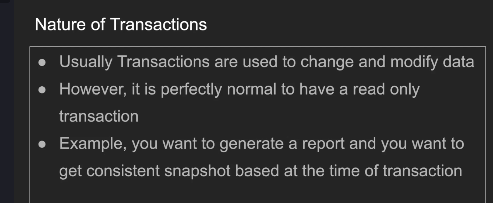

- So Transactions are not for writing but also reading and while doing so we can come across different types of Reads based on different types of Isolation levels we have in different databases.
- Thus reading from database also needs consistency.
    
    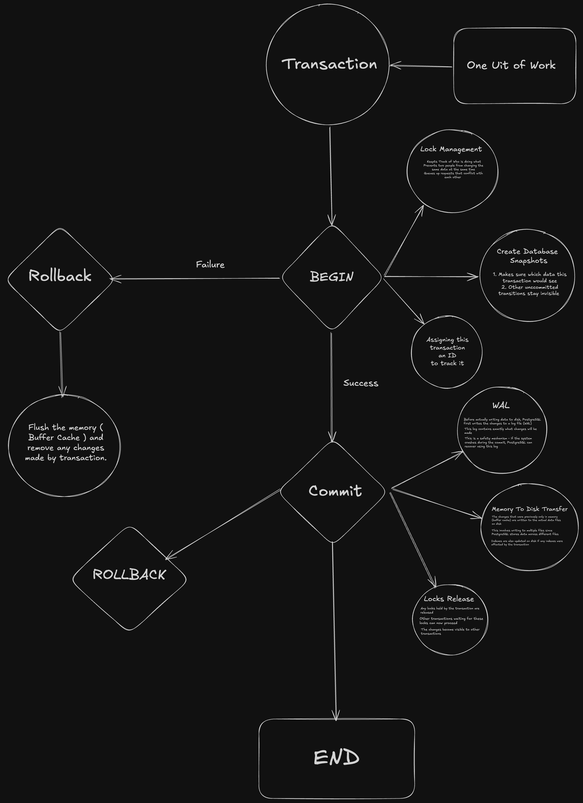
    

## What Is Atomicity

> All queries in a transaction must succeed
> 
- If any particular query fails, all prior success-full queries should rollback .
- if the database fails before commit all transactions ( successfull queries ) should rollback
- Longer transactions takes longer time to Rollback, thus longer transactions are discouraged.

Atomicity is the idea of Transaction being one unit of work and that cannot be split 

### Wy we need it ?

Lack of atomicity leads to many problems like 

- If system crashed during a on gong transaction then we will see inconsistencies accross database.
    - Like we debit $100 from Account A but couldn’t debit this $100 to Account B due to db crash ? this is inconsistency.
- Thus Atomic Transaction is one which should rollback all queries if one or more queries failed.

## Isolation

> Some times multiple transactions running simultaneously can causes one transaction to read stuff written by another transaction, this leads to several Read Phenomenas
> 

### Read Phenomena

its has few types 

### Dirty Read

> This happens when a transaction reads data that another transaction has modified but not yet committed. If the second transaction is rolled back, the first transaction has read invalid data.
> 

Imagine two transactions in a bank database.

- **Transaction A**: Updates a customer's balance from $1000 to $500 but hasn't committed yet.
- **Transaction B**: Reads the customer's balance and sees $500 (the uncommitted change from Transaction A).
- If **Transaction A** then rolls back, the actual balance should still be $1000, but **Transaction B** has already read the incorrect $500.

### Non-Repeatable Read

> This occurs when a transaction reads the same data multiple times and gets different results each time. This happens because another transaction has modified the data in between the reads.
> 
- In postgres you always read original version from the time you initiated a transaction

Example

- **Transaction A**: Reads a customer's balance, which is $1000.
- **Transaction B**: Withdraws $300 from the same account and commits, updating the balance to $700.
- When **Transaction A** reads the balance again, it now sees $700.

### Phantom Read

> This happens when a transaction re-executes a query and finds new rows that weren't there before. This is because another transaction has inserted or deleted rows that affect the result set of the query.
> 

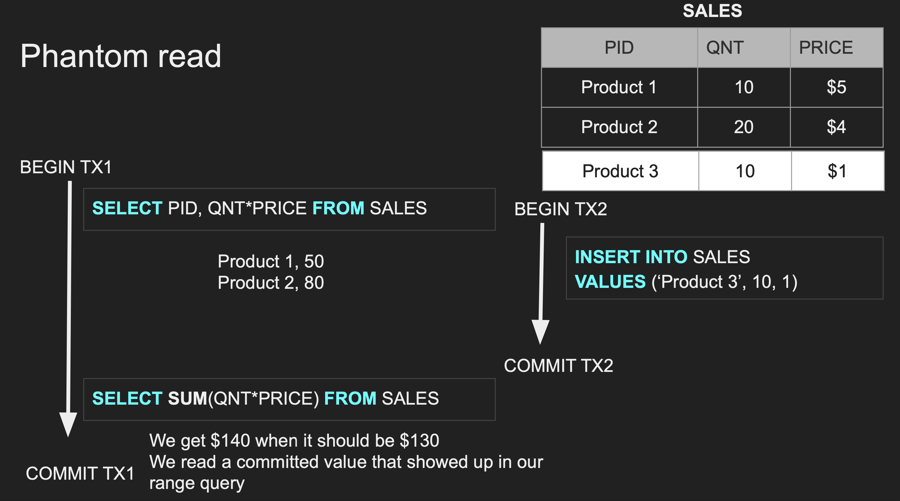

## **Non-Repeatable Read vs. Phantom Read: Explained with Examples**

### **Non-Repeatable Read**

**Definition**: Occurs when a transaction re-reads the **same row** and finds that the data has been **modified or deleted** by another committed transaction. This happens because the row was **updated** after the initial read.

**Key Cause**: An `UPDATE` or `DELETE` operation by another transaction.

**Real-Life Example**:

1. **Bank Balance Check**:
    - **Transaction A** reads your account balance (e.g., $1000).
    - **Transaction B** deposits $500, updating the balance to $1500 and commits.
    - **Transaction A** reads the balance again and now sees $1500.
    - The same row (your account) was modified, causing inconsistent results within Transaction A.

---

### **Phantom Read**

**Definition**: Occurs when a transaction re-executes a query and finds **new rows** (phantoms) that were inserted or existing rows that were deleted by another committed transaction. This happens due to `INSERT` or `DELETE` operations.

**Key Cause**: Changes to the **number of rows** matching a query’s criteria.

**Real-Life Example**:

1. **Hotel Room Booking**:
    - **Transaction A** searches for available rooms (e.g., 3 rooms) using a query.
    - **Transaction B** books one of those rooms (inserts a booking record) and commits.
    - **Transaction A** re-runs the same query and now sees 2 rooms available.
    - A new row (booking) was added, altering the result set.

---

### **Key Differences**

| Aspect | Non-Repeatable Read | Phantom Read |
| --- | --- | --- |
| **Cause** | `UPDATE` or `DELETE` on existing rows. | `INSERT` or `DELETE` altering rows. |
| **Impact** | Same row’s data changes. | New rows appear/disappear. |
| **Isolation Fix** | Prevented by `REPEATABLE READ`. | Requires `SERIALIZABLE` isolation. |

---

### **Summary**

- **Non-Repeatable Read**: "The same row changed."
- **Phantom Read**: "New rows appeared or vanished."

Understanding these differences helps in choosing the right database isolation level to balance consistency and performance .

### **Lost Updates**

**Definition**: Occurs when **two transactions** modify the **same data concurrently**, and one of the updates is **overwritten** (lost) because there’s no mechanism to detect or prevent conflicting writes.

**Key Cause**: Concurrent `UPDATE` operations without proper locking or isolation.

**Real-Life Example**:

- **Collaborative Document Editing**:
    - **User A** opens a document and edits a sentence.
    - **User B** opens the same document *at the same time* and deletes the same sentence.
    - **User A** saves their changes, then **User B** saves theirs.
    - **Result**: User A’s edit is overwritten by User B’s deletion. The update from User A is "lost."

## Isolation Levels

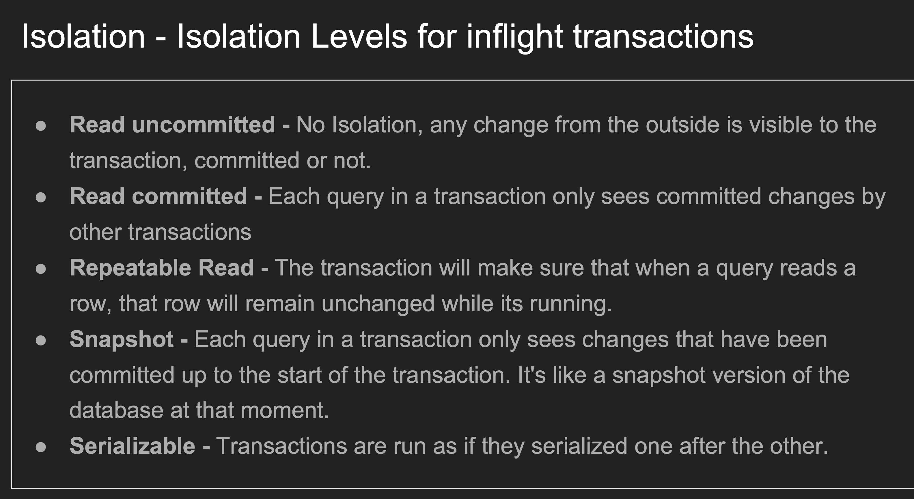

- Postgres Reapeatable Reads does not have Phantom Reads as compare to other databases because it uses RR as snapshot.( RR and snapshot are same )

## Consistency

- Eventual consistency cannot exist `Consistency in Data` as if there is no data for particular thing its not going to be consistent in future but `Consistemcy in Read` can be eventually as the read not consistent may be in a while.

## Durability

- Changes made by a transaction must be committed must be persisted in durable non-volatile storage ( hdd or SSD )

### Durability Techniques

- WAL - Write ahead log ( saves only delta of transactions ( changes in database ) in non-volatile memory ). So if there is a crash we can go back and build all back from this WAL.
- Asynchronous Snapshot - while we write we keep everything in memory then asynchronously we snapshot everything to disk at once.
- AOF - Append only Files, keeps tracks of the changes of what happens and then writes these things.
    
    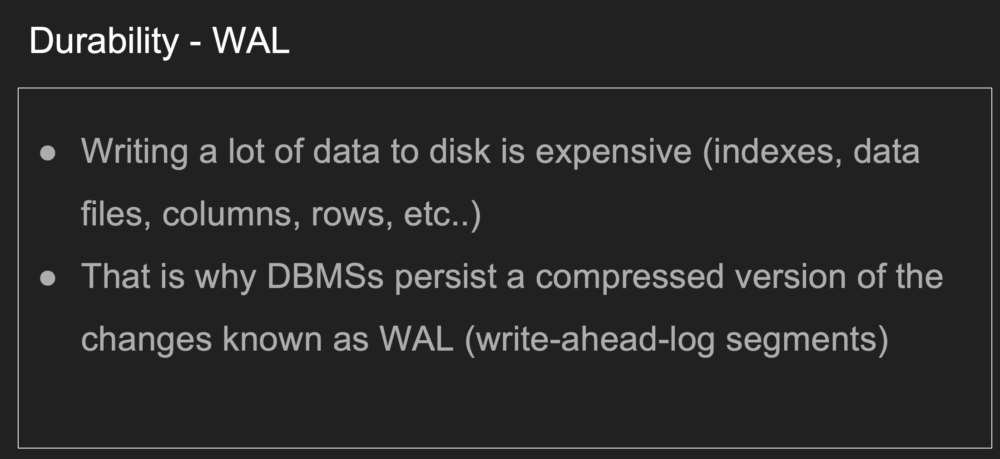
    
    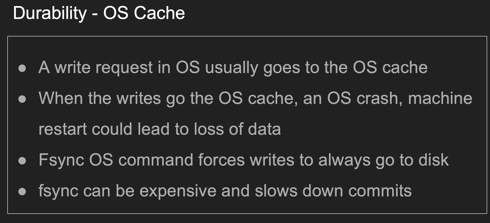
    

## Phantom Reads Example

To avoid this  we use Serialisation Isolation level ( Transaction ), 

- Postgres or any other database which detects that if there is a dependency of current transaction on anything it will try to isolate those changes

Such transaction can be run using

```sql
begin transation isoltation level seriaizable;
```

- Postgres however goes extra mile and does one another thing i.e it isolates dependecies even in another isolation levels such as `repeatable read` .
- While in MySQL we will see phantom reads in repeatable  read isolation.

## Serialisable vs Non Repeatable Read Isolation

Non-Repeatable Read


Serialisable Read

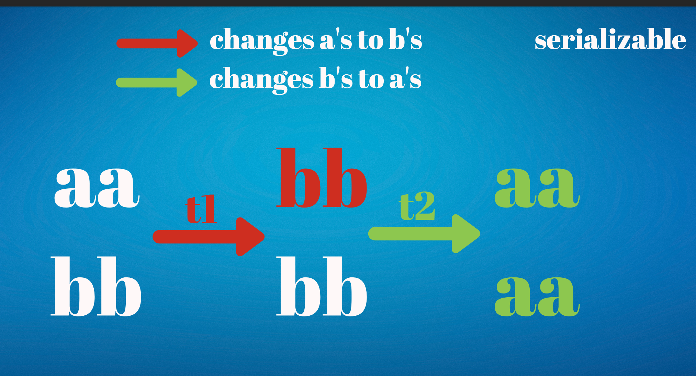

We can see the difference clearly as we arrive at different states of data when we do Non-Repeatable Reads while same state when serilisable.

### Example By Code

- Start two transactions on same database ( two different instances )

```sql
begin transaction isolation level repeatable read;
```

```sql
begin transaction isolation level repeatable read;
```

- first instance

```sql
update test set t = 'a' where t = 'b';
```

- second instance

```sql
update test set t = 'b' where t = 'a';
```

now in each instance if we query database we would get all `a's` and `b's` in each transaction.

Commit and then check and its 2a’s and 2b’s which is not what we want, we want to either all `a’s`or all `b’s`

- Again do using Serializable Isolation

```sql
begin transaction isolation level serializable;
```

- now if we commit transaction 2 and try to commit trasnsaction 1 first time it would fail and give error that there is read/write dependency among transaction. If we retry it again it would work fine.

## Consistency

- It has two sub types

Consistency in Data 

consistency ensures that a transaction brings the database from one valid state to another. It means that any data written to the database must follow all defined rules, including constraints, cascades, triggers, and any combination thereof.

**Example of Consistency in a Banking System:**

Imagine a bank database with two tables: `Accounts` and `Transactions`.

- **Consistency Rule**: The sum of debits and credits in the `Transactions` table for an account should always match the account balance in the `Accounts` table.

**Scenario:**

- **Transaction A**: Withdraws $100 from an account with a balance of $1000.
    - This should result in an update to both the `Accounts` table (balance becomes $900) and a record in the `Transactions` table.

If the transaction only updates the balance in the `Accounts` table but fails to record the corresponding transaction, the database would become inconsistent. Consistency ensures that either all related changes are made, or none are, keeping the data valid.

In short, consistency means all data integrity rules are followed, and the database remains in a valid state after a transaction.

- Consistency in data should be Atomic ( if one fail all should fail ) and Isolated .


### Rule of Thumb

When you have cache you will have inconsistency until you update so that is eventual consistency.

`Eventual consistency is for the Reads only` → remember 

## Understanding Database Internals

### How tables and Indexes are stored on disk

Agenda 

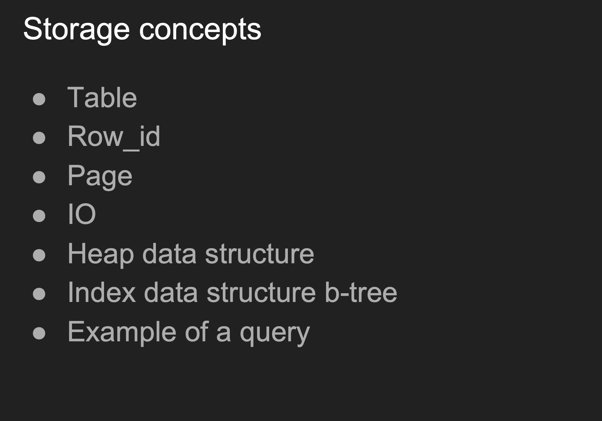

**Row_ID**
- System maintained
- Some cases its same as primary key ( innoDB and mysql ) but other databases like postgres have system column  (row_id) or (tuple_id)

**Page** 

- Simply a fixed size memory location / disk location.
- Each page can store multiple rows.
- Each Database type like postgres or mysql has default page size as 8kb and 16kb respectively/
- But page size is configurable.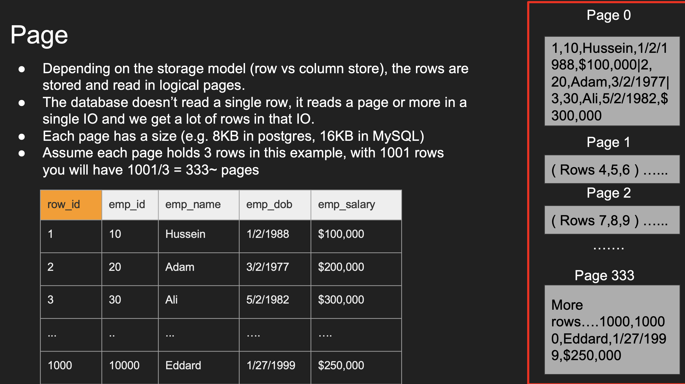
    

### IO

- The lesser IOs we make the better it is in terms of cost and peformance.
- Like if we fetch a name from a table, IO will go to disk to get whole page or set of pages and not only that particular row, its the database which will filter out the stuff we do not want and throw it away.
- Postgres relies haevily on OS thus its IO might go to OS cache rather than disk itself.

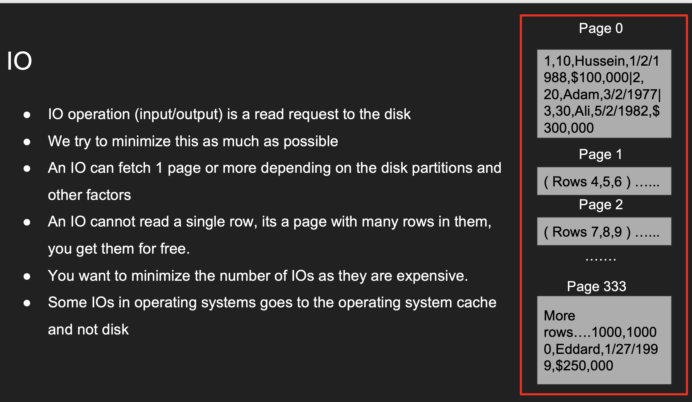

### HEAP

> A collection of pages that point to our data table. It has everything about the table itself
- Since it contains all data related to table, its heavy and is expensive to query as has alot of data
- We need `indexes` to be able to read exaclty the page we need to, without `indexes` we cannot know which particular page to look for our data. Then we will have to read entire `Heap` . Which is costly


### Index

> A Datastructure that has pointers to heap. These are numbers that point to row_id we discussed earlier.
> 
- Its essentially B-tree or LSM etc , which we have to read first and then parse the content to know where our page is in Heap.
- Thus reading stored index has IO cost as its stored as a page itself.
    
    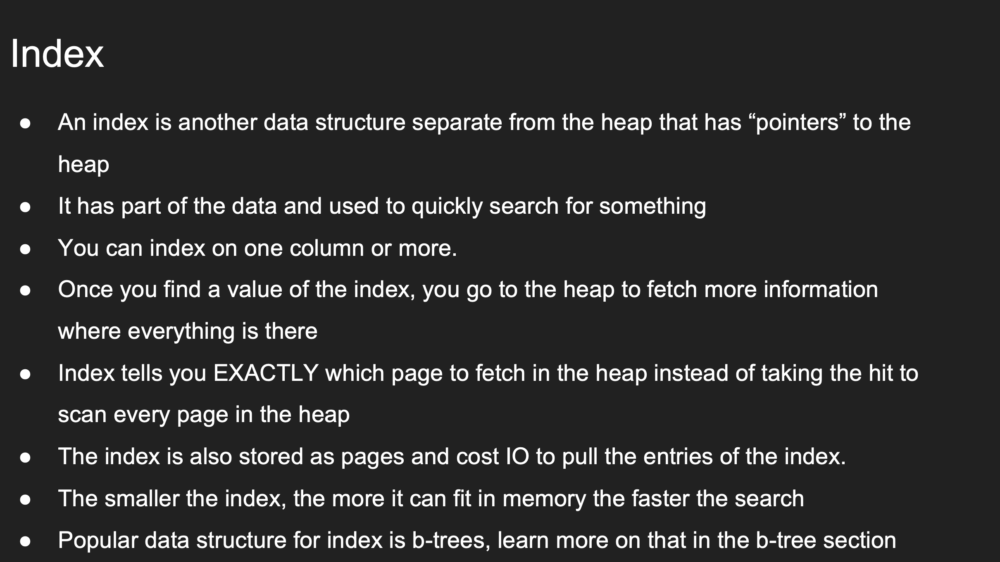
    

### Example

- The index are stored for Emloyee_ID like 10 ( 1,0 ) or (row, page)

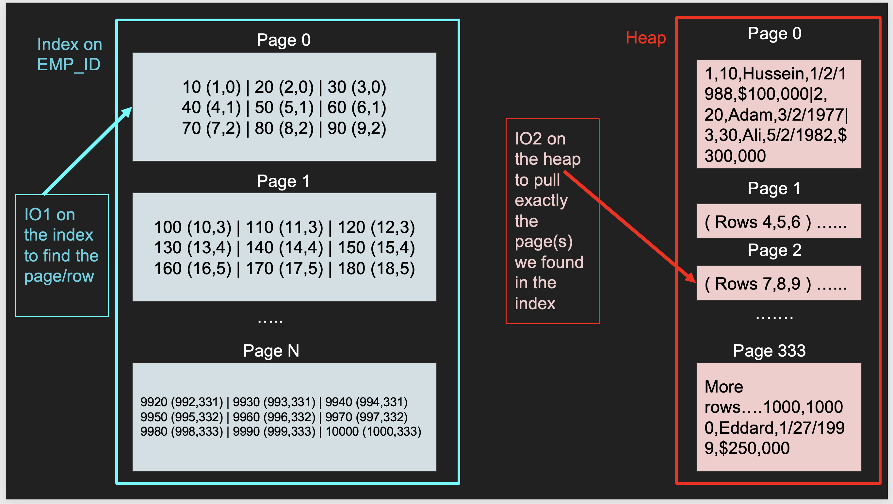

- Becuase of index stored we can quickly determine which page no to look for in heap and also which specific row.
- When we retreive the specific page, we get all the rows there ( as IO gets whole page ) but we throw them away and only focus on the row that was specified.

### Notes

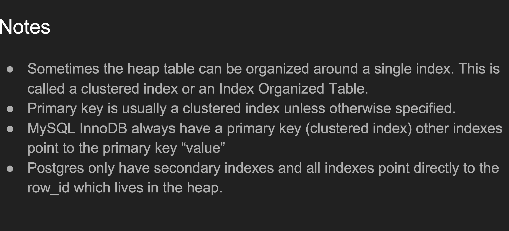

- normally primary key is a clustered index unless its postgres ( it s essentially a secondary key pointing to row_id generated by postgreSQL )

## Row Vs Column store

### Row Oriented

### Remember all these examples are without Indexes

- Running query for Ssn would have to go through each storage block/blob and see if it has required SSN if not move ahead. Anyway IO operation will be costly here as we have to fetch entire block no matter how many rows it has.

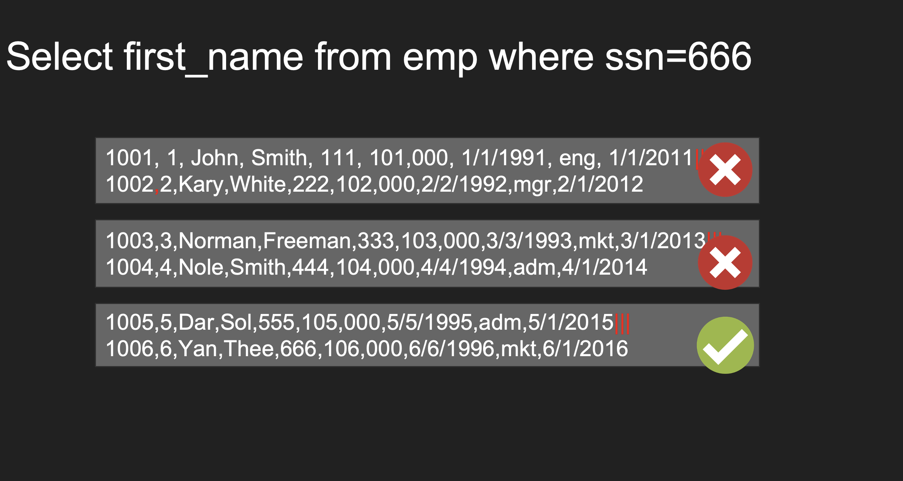

- in case of * query is not that much expensive beside finding the block/blob in storage, when we have it we can get al columns as they are there in same storage block/blob while it is definitely tough in `Column oriented`
    
    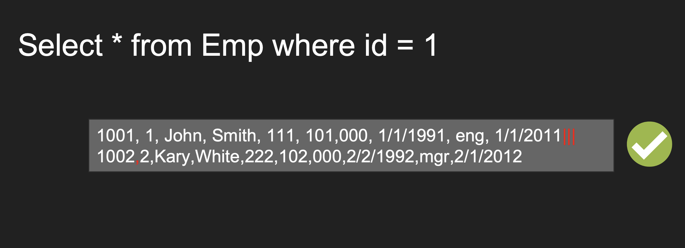
    
- Also remember row can always span multiple blocks/blobs if its too large or huge in number
- So if fetching such a row, if * query then database would get all blocks/blobs from storage to return all columns in specific row.
- Otherwise if we selected only few columns, Database is smart enough to fetch only  blocks/blobs from storage having columns required.
- Aggregate queries are very IO expensive in row oriented databases because we have to get an entire block/blob from storage only to get one column value and so on for all storage

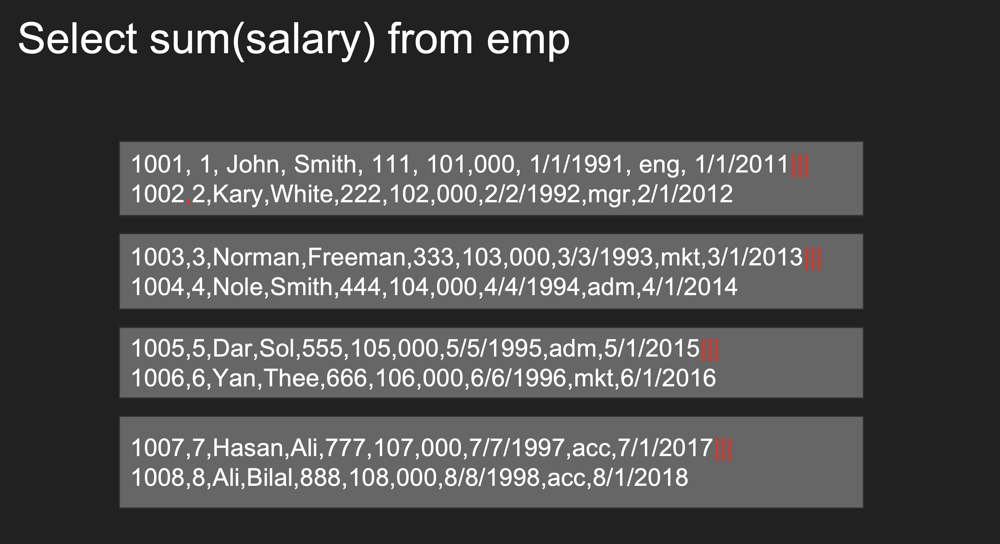

### Column Oriented


- Fetching same column is much efficient in case of this orientation as entries of same colum are stored sequentially in storage blocks/blobs.

### Example Queries with Indexing

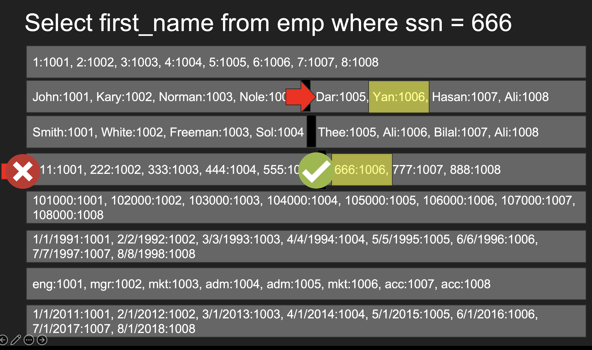

- Being column oriented, database knows where SSN column is , gets first block no 666 then second block has ssn=666 , it points to row 1006 and first_name
- Datase knows where first_name block is and since has row value 1006 knows which particular block of first_name column it should check.
- The worst query because of how many IOs are here ( equal to no of total columns we have in database if the column referenced is found in first block otherwise we are doomed )
    
    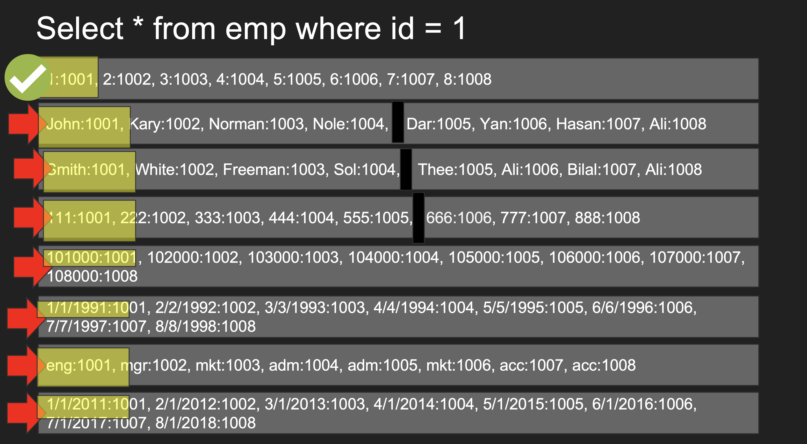
    
- The best query
    
    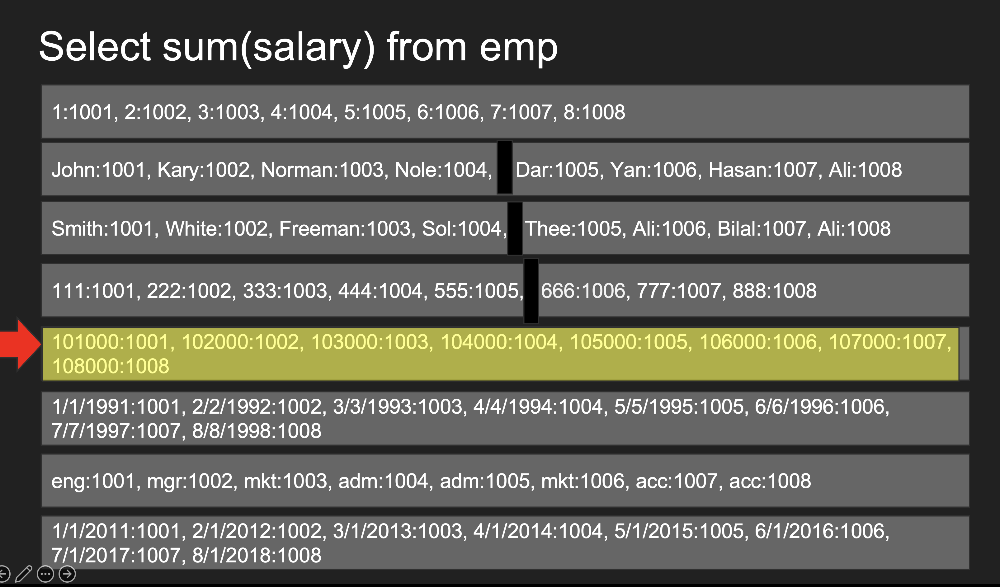
    
    ### Summar y
    
    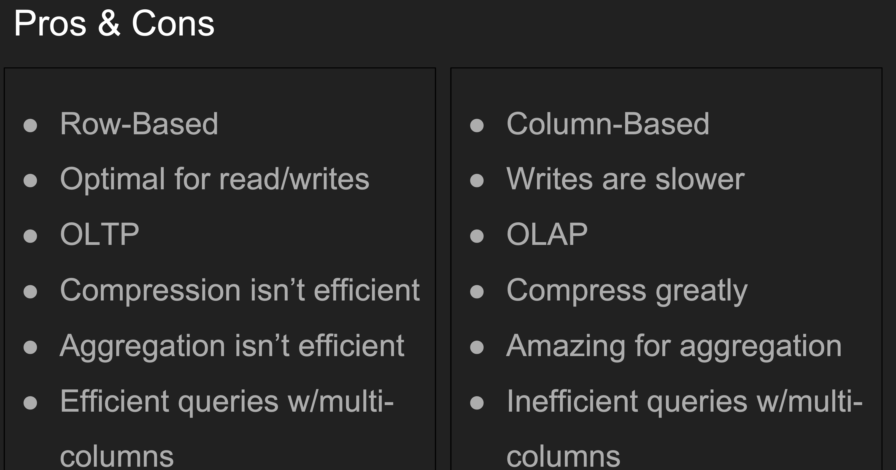
    
- OLTP ( On-line transaction processing ) easy to write WAL because we know what we are changing exactly
- Compression is not efficient in case of row orientation as most probably different typed data would be consequent while in column similar typed data is consequent ( same block ) which increases chances of duplicated values being found and thus good compression.
- Aggregation queries are amazing in column databases since all values for given column might lie in same block or multiple consequent blocks as comapre to all different blocks and fetch uneccessary columns which are not even needed. 

## Question

### Why is Select * an expensive query

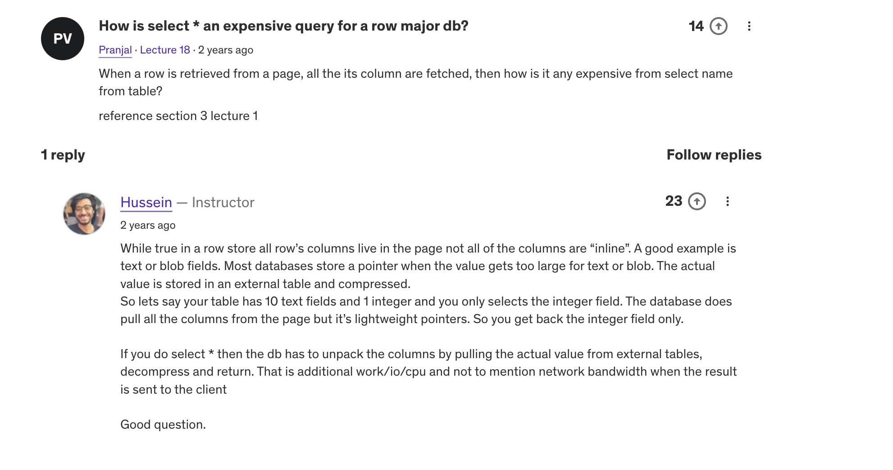

## Primary key vs Secondary Keys

- Ordering is important in databases otherwise retrieving something would be difficult.
- That is where databases do clustering, i.e Organising the table around a key  ( primary key )
- that is why in postgres primary key is also called clustered index.
- Since data has to be clustered around primary key in HEAP, thus it has its extra costs.
- lest say we insert row 1 , then row 8 ( goes after row 1 ) and then row 2 ( which will have to be put in between 1 and 8 so has its cost )
- Although databases are smart and keep in pages, row 1 would be in a page and then row 8 would be in another page and not in same page because databases knows that  between 1 and 8 there are 6 rows that need to be filled.
- Its beneficial specially in range queries where we have to query for something from databases. because all items would be staked together, and it would only take a singe IO

In case of secondary key, or table would be a jumbled mess and not organised ,  But there is a separate structure ( indexes ) which is organised. 

- We will have to first query for secondary index ( that structure ) which will provide us info about pages ( where our actual data lies ).
- That is a disadvantage to make that jump to HEAP to get actual data.

> postgres indexes are all secondary indexes
> 
- Index Organised Table ( IOT )

## Pages

[](https://www.udemy.com/course/database-engines-crash-course/learn/lecture/37150148#questions/17228860)

SQL server Page layout and Details

[Pages and Extents Architecture Guide - SQL Server](https://learn.microsoft.com/en-us/sql/relational-databases/pages-and-extents-architecture-guide?view=sql-server-ver16)

Page layout Postgres 

[65.6. Database Page Layout](https://www.postgresql.org/docs/current/storage-page-layout.html)

## Database Indexing

### Create Postgres database with millions rows

```bash
docker run -e POSTGRES_PASSWORD=postgres --name pg1 postgres
```

```sql
docker exec -it pg1 psql -U postgres
```

generate a table 

```sql
CREATE TABLE temp(t int);
INSERT INTO temp(t) SELECT random()*100 FROM generate_series(0,100000);
```

[one-million-pg.txt](Fundamentals%20of%20Database%20Engineering/one-million-pg.txt)

### Indexing

`explain analyze` followed by a query returns details about the performance and lets us know what is actually happening in given query 

like

```sql
explain analyze select id from employees where id = 2000;
```

- The slowest queries are ones where we have to go to HEAP, i.e actual tables stored in pages / disk
- so like querying for name field which is not an index.
- also further slow are ones where we use patterns match using `Like` `ILike` commands which force database to go Table / Heap to sequentially go through each value to find pattern.
- Also using expressions even waste having an index because of its nature to visit HEAP / Table.

### Explain

commands for this part 

```sql
--explain explained

-- make sure to run the container with at least 1gb shared memory
-- docker run --name pg —shm-size=1g -e POSTGRES_PASSWORD=postgres —name pg postgres

create table grades (
id serial primary key, 
 g int,
 name text 
); 

insert into grades (g,
name  ) 
select 
random()*100,
substring(md5(random()::text ),0,floor(random()*31)::int)
 from generate_series(0, 500);

vacuum (analyze, verbose, full);

explain analyze select id,g from grades where g > 80 and g < 95 order by g;

create index grades_g on grades(g);

```

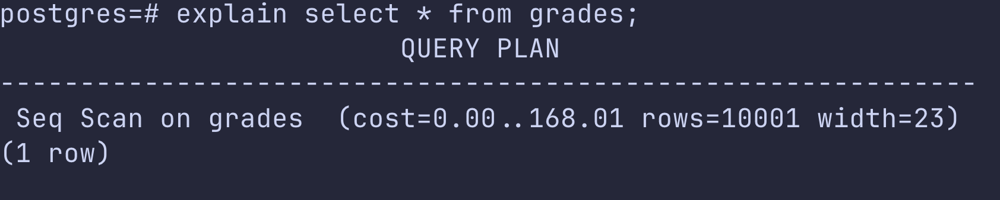

1. First is usually the `query plan` which is `seq scan` or `Full Table Scan` 
2. Cost has two numbers separated by `..` as `n1..n2`
3. `n1 → how much time (ms) to fetch first page` ( disk area where rows stored ) 
    1. Because postgreSQL immediately went to first page and retrieved first row.
    2. That is why `Limit` queries are very fast .
    3. This number can increase if postgres decides to do some work before fetching such as aggregation queries, order-by
4. `n2 -> how much time (ms) it may take to really execute the query`
5. value of `rows` is also approximate, it shows that database thinks these are no of rows database is going to fetch.
    1. The best suggestion specially in case of `count` query where actual count value does not matter is to use explain so you get a approximate value and not actual value which will obviously take time. ( e.g no of likes on a post in instagram )   
6. `width` is the sum of bytes of all columns in a single row.

Another example of a `Order By` query

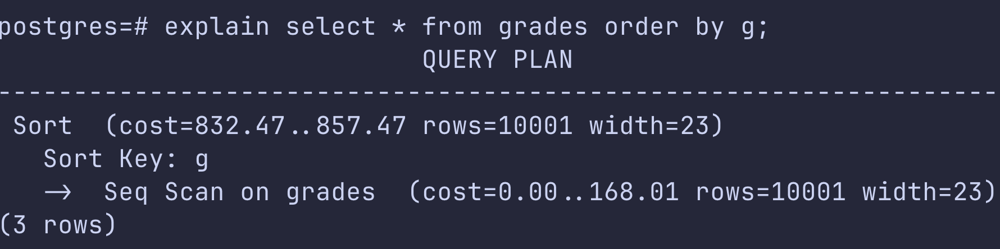

- order by name

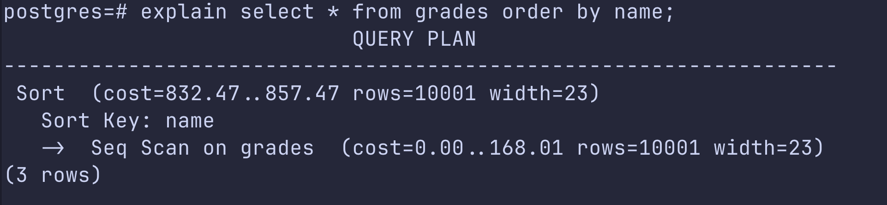

also read from bottom to Top ( correct way )

- width is 4 bytes because its only one field

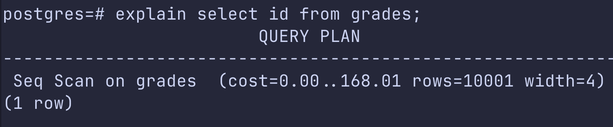

- now width is 15 ( which is average length of the name not exact as name lengths vary here )

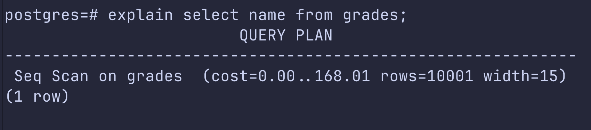

### Bitmap Index vs Index vs Table Scan

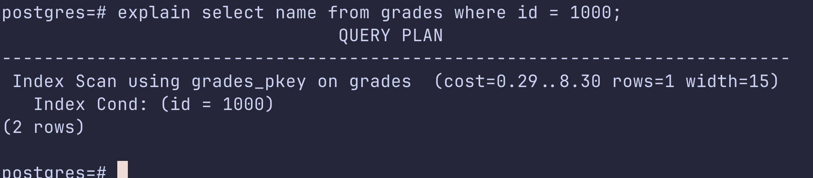

Postgres is smart enough to decide what to chose specially when no of results to fetch are very large or smaller 

- It will chose index scan ( if index exists offcourse ) and use random access to heap to fetch results
- Or will chose simle sequential scan in case of large results

```sql
SELECT name FROM grades WHERE id < 100;
```

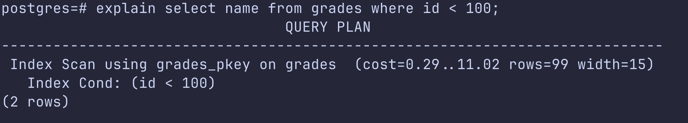

Index scan ( fetch name column, using B-Tree which is fast enough )

```sql
	SELECT name FROM grades WHERE id > 100;
```

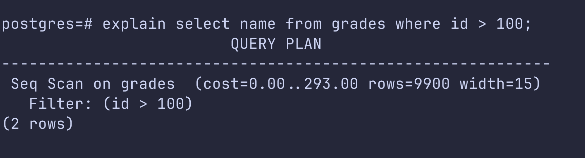

sequential scan

### Bitmap Index Scan

- Here we scan on Index , find the row and mark its page no in bitmap ( its 1’s and 0s ) where 1 shows the page value like 9th 1 is page 9.
- Once all rows are scanned and added to bitmap then we jump to heap once and fetch all those.
- since each age may not contain exaclty one row , so it can have one or more row, so if any extra row is fetched its filtered and dropped as per condition.
- But this does not happen always

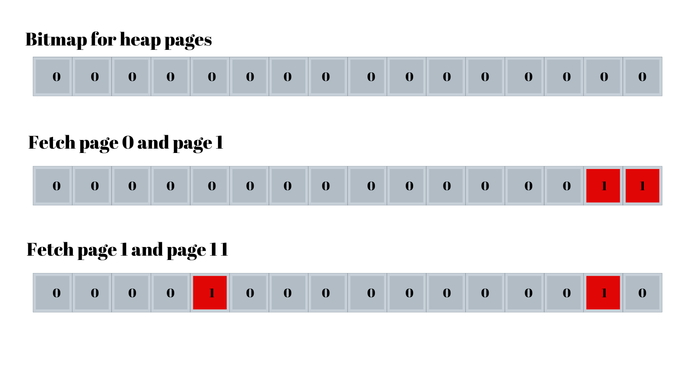

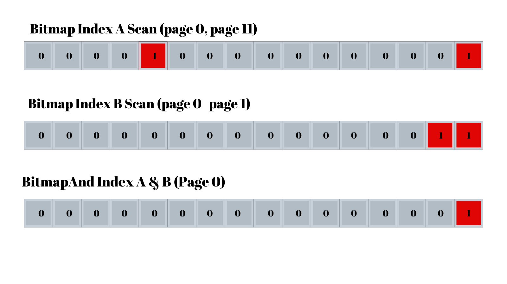

- Then we sometimes also get across two Bitmap Index scans `AND` together, so that where even one of them has page value 1 is ignored as we have AND in the query. finally we do a bitmap heap scan on result of AND of both bitmaps

Bitmap Heap Scan is preferred when there are larger number of random IO to different parts of table or we have large number of rows but they are not that large and we can efficiently use index there so then we prefer Bitmap Heap Scan over Index Scan or Full Table ( Sequential Scan ).

### Key vs Non Key

- When we create an index on a single or more column we form a B-Tree index over it. This key formed is used for searching purpose.
- The entries found in the key / index are pointer to actual rows in the HEAP or disk
- While `Non-key` indexes are in cases where we create index and inlcude another column with it which is not a key.
- in `Key` case we have access to that particular column we included as `key` in index while in case where we included `non-key` with index we can search for this non key as its already there in index.  THis would make search faster while otherwise we would have to go to HEap for `non-key` columns as they are only in the heap

[students.sql](Fundamentals%20of%20Database%20Engineering/students.sql)

```bash
--key vs non-key columns

-- make sure to run the container with at least 1gb shared memory
-- docker run --name pg —shm-size=1g -e POSTGRES_PASSWORD=postgres —name pg postgres

create table students (
id serial primary key, 
 g int,
 firstname text, 
lastname text, 
middlename text,
address text,
 bio text,
dob date,
id1 int,
id2 int,
id3 int,
id4 int,
id5 int,
id6 int,
id7 int,
id8 int,
id9 int
); 

insert into students (g,
firstname, 
lastname, 
middlename,
address ,
 bio,
dob,
id1 ,
id2,
id3,
id4,
id5,
id6,
id7,
id8,
id9) 
select 
random()*100,
substring(md5(random()::text ),0,floor(random()*31)::int),
substring(md5(random()::text ),0,floor(random()*31)::int),
substring(md5(random()::text ),0,floor(random()*31)::int),
substring(md5(random()::text ),0,floor(random()*31)::int),
substring(md5(random()::text ),0,floor(random()*31)::int),
now(),
random()*100000,
random()*100000,
random()*100000,
random()*100000,
random()*100000,
random()*100000,
random()*100000,
random()*100000,
random()*100000
 from generate_series(0, 50000000);

vacuum (analyze, verbose, full);

explain analyze select id,g from students where g > 80 and g < 95 order by g;

```

- This insert query is gonna take some time ( like about 15 minutes 👹 ). We are inserting 50 million rows almost so it deserves that much.
- There are no indexes in this table.

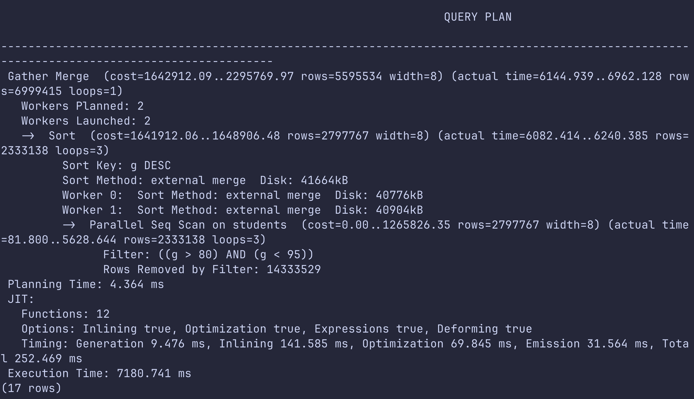

this query is much slower as we can see its not a good query becuase we have no index 

- lets create an index on `g`

```bash
CREATE INDEX g_idx on students(g);
```

- Lets make the query again now

```bash
explain analyze select id, g from students where g > 80 and g < 95 order by g desc;
```

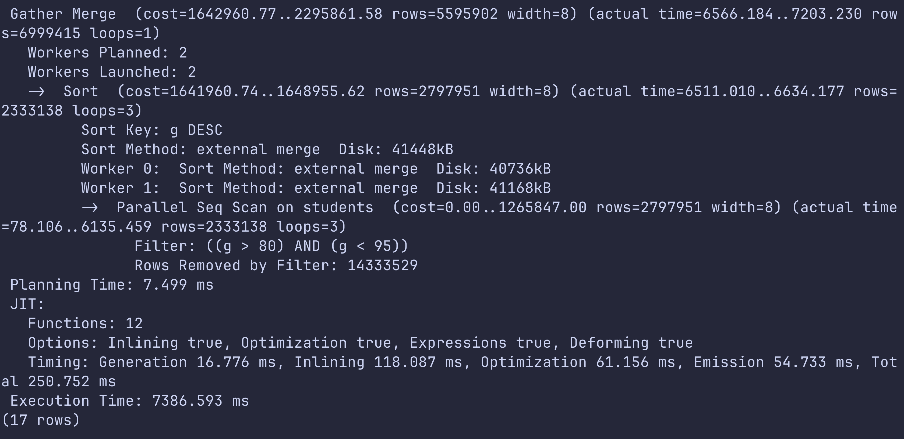

in case of Hussiain Nasser, it ran Index Scan Backward while it still ran Gather merge in my case which is weird ? 

- The backward is becuase we are ordering by desc on `g` column.
- But applying limit on same query results in much quicker response as you can see.

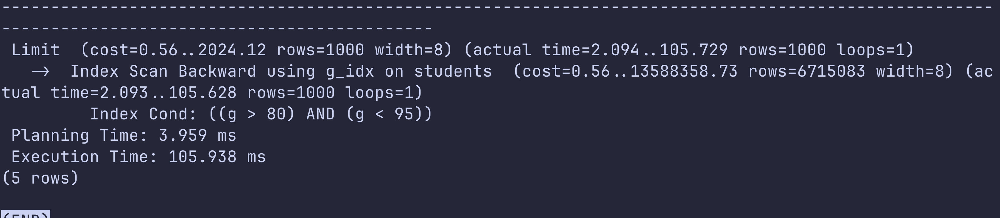

but its not always this fast as if we incldue buffers in with (analyze, buffers ) we see that shared-hit = 20 means all things we queried are cached.

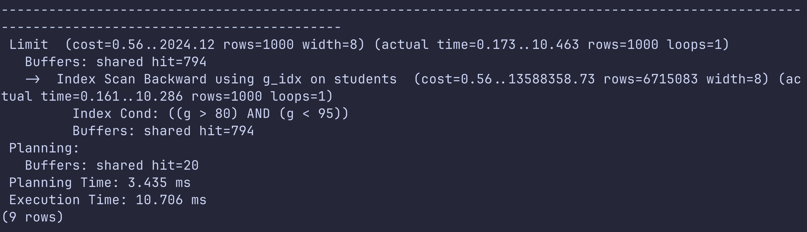

- lets trick OS to make new query so results are not cached now.

```bash
explain analyze select id, g from students where g > 10 and g < 20 order by g desc limit 1000;
```

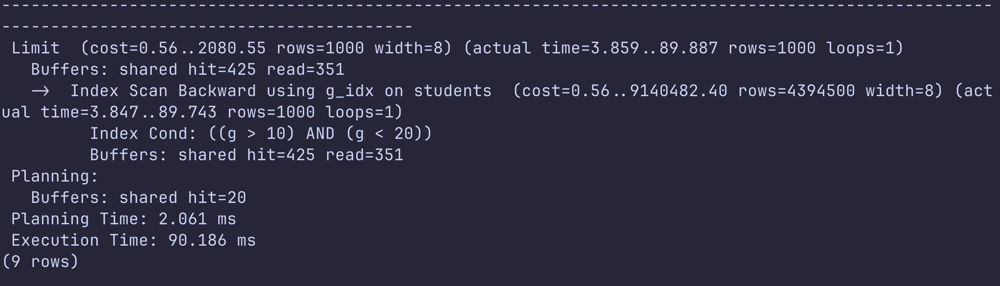

we did something better here as `read=351` while shared hit is only `425` so it means we did get 351 pages from disk and now Execution time is increased to 90ms from 10ms

- its taking alot of time as we have to go to HEAP to bring id, now lets make this index only scan
- Drop the index g_idx

```bash
Drop INDEX g_idx;
```

- lets include id as key in the index

```bash
create index g_idx on students(g) include(id);
```

- Now see `Index Only Scan` its 11ms as we never went to HEAP because `Heap Fetches = 0`

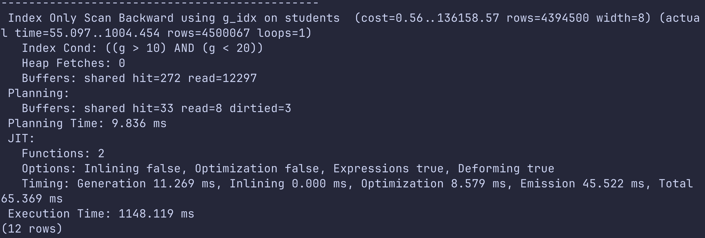

we still went to disk for `read=12297` ,